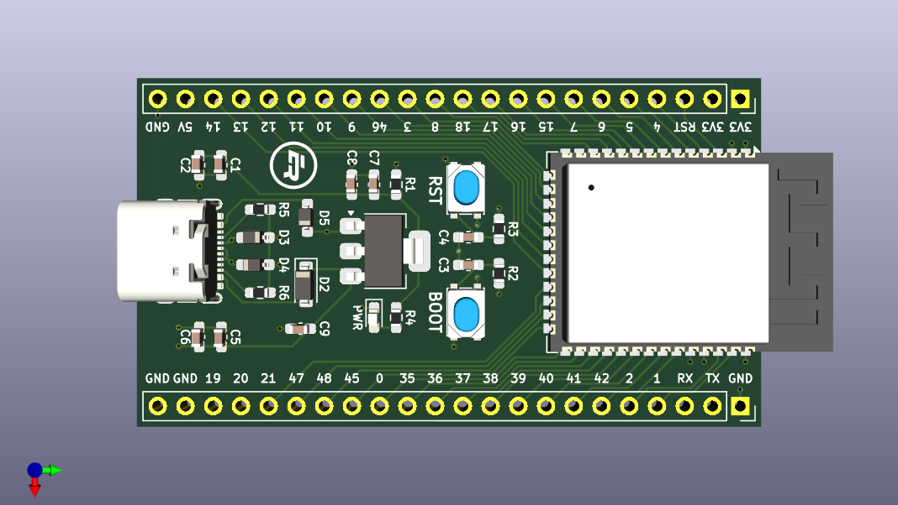

# ESP32-S3-DevBoard

A custom-built development board using the ESP32-S3 chip



## PlatformIO Setup

**NOTE:** This process only needs to be performed once for each development board

1. Download the Zadig driver installation program here: https://zadig.akeo.ie
2. Open Zadig, then click `Options -> List All Devices`
3. Select `USB JTAG/serial debug unit (Interface 0)` and change the driver to **USB Serial (CDC)**
4. Click "Upgrade/Downgrade Driver" (please note, this process may take a few minutes)
5. Select `USB JTAG/serial debug unit (Interface 2)` and change the driver to **libusbK**
6. Click "Upgrade/Downgrade Driver" (please note, this process may take a few minutes)
7. In PlatformIO, configure the platformio.ini file as follows:

   ```ini
    [env:esp32-s3-devboard]

    platform = https://github.com/platformio/platform-espressif32.git
    board = esp32-s3-devkitc-1
    framework = arduino

    upload_speed = 2000000
    monitor_speed = 115200

    debug_tool = esp-builtin
    debug_init_break = break setup
    build_type = debug

    ; enables CDC mode (activates USB-to-Serial)
    build_flags = -DARDUINO_USB_CDC_ON_BOOT=1
   ```

## USB Interface Options

### UART Uploading / Monitoring (Standard)

1. Click the PlatformIO icon on the Activity Bar (left)
2. Navigate to `PROJECT TASKS > esp32-s3-devboard > General > Upload and Monitor` (top left)
3. The firmware will be uploaded automatically and the serial output will be displayed in the terminal

### JTAG Debugging + VCOM Monitoring (Advanced)

1. Click the PlatformIO icon on the Activity Bar (left)
2. Navigate to `QUICK ACCESS > Debug > Start Debugging` (bottom left), or press `F5`
3. The firmware will be uploaded automatically and the debug toolbar will appear (top middle)
4. Use the debug toolbar to Pause/Unpause, Restart, or Stop the program (also has code stepping)
5. To view the serial output while code is unpaused, click `PlatformIO: Serial Monitor` on the Status Bar (bottom)
